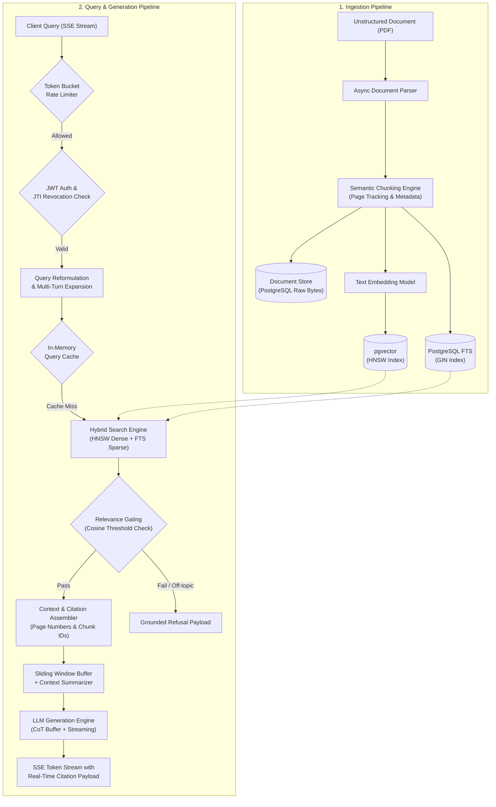

# KueryCore

> **Enterprise Document AI & Production-Hardened Hybrid RAG Engine**

KueryCore is an enterprise-grade Retrieval-Augmented Generation (RAG) platform engineered to parse, index, and query unstructured documents with sub-second hybrid retrieval and deterministic citation fidelity. Designed for organizations operating in data-intensive and compliance-heavy environments, it combines dense vector indexing, sparse full-text search, and multi-layered guardrails into a single, scalable pipeline.

---

## ◈ System Architecture & Request Lifecycle



---

## ◆ Core Capabilities

* **Hybrid Dense & Sparse Retrieval:** Combines semantic search via `pgvector` (HNSW indexing) with PostgreSQL Full-Text Search (`tsvector` with GIN indexing) via Reciprocal Rank Fusion to eliminate keyword misses.
* **Fail-Closed Guardrails & Relevance Gating:** Evaluates retrieved chunk similarity against strict cosine thresholds; rejects out-of-domain or adversarial prompts before passing context to the LLM.
* **Deterministic Citation Grounding:** Tracks chunk offsets and page numbers across all ingestion stages, returning explicit source indices and citation cards alongside streamed tokens.
* **Chain-of-Thought (CoT) Stream Sanitization:** Isolates internal model reasoning steps in a dedicated scratchpad buffer, preventing internal traces from leaking to end users.
* **Multi-Tenant Security & PostgreSQL RLS:** Enforces Row-Level Security (RLS) policies directly at the database layer, isolating documents, chunks, and conversation histories per tenant ID.
* **JTI-Based Token Revocation & Sliding Rate Limiting:** Implements stateless JWT authentication paired with a Redis/in-memory token revocation registry and per-IP/per-user rate limiters.
* **Conversational Context Compression:** Condenses multi-turn dialogue histories using async summarization jobs to keep prompt tokens well within model context limits.
* **Evaluation & Benchmark Harness:** Built-in evaluation framework equipped with synthetic test sets, precision/recall benchmarks, and regression testing suites.

---

## ◇ Technical Specifications

| Layer | Component | Technology | Version | Purpose |
| --- | --- | --- | --- | --- |
| **API Server** | Framework | FastAPI / Uvicorn | `0.110.0+` | Asynchronous REST and Server-Sent Events (SSE) streaming |
| **Data Layer** | Relational Database | PostgreSQL | `16.0` | Relational storage for users, metadata, and chats |
| **Vector Engine** | Vector Extension | `pgvector` | `0.7.0+` | Hierarchical Navigable Small World (HNSW) indexing |
| **ORM & Migrations** | Database Tooling | SQLAlchemy (Async) / Alembic | `2.0+` / `1.13+` | Asynchronous schema definitions and migration versioning |
| **AI & Pipeline** | RAG Orchestration | LangChain / Custom Pipelines | `0.2.0+` | Query rewriting, hybrid fusion, and token stream parsing |
| **Inference** | Primary LLM APIs | Groq (LLaMA 3.1) / Google Gemini | `API` | Low-latency inference and high-capacity context analysis |
| **Frontend** | Single Page App | React / Vite | `18.3+` / `5.0+` | Interactive UI with real-time markdown and stream parsing |
| **Styling** | CSS Engine | Tailwind CSS | `3.4+` | Component-level UI styling |
| **Testing** | Test Runners | Pytest / Vitest | Latest | Unit testing, integration suites, and UI testing |

---

## ◈ Database Schema & Migration Ledger

Database state is tracked via deterministic Alembic revisions located in `backend/alembic/versions/`:

* `f92ad0e9222a_initial_migration.py`: Base schema initialization for core entities.
* `e5f67a890123_add_users_and_multitenancy.py`: User tables, tenant partitioning, and API keys.
* `423b2164b299_enable_rls_on_public_tables.py`: PostgreSQL Row-Level Security (RLS) policies.
* `b7562f370bd8_use_hnsw_vector_index.py`: Migration from flat IVFFlat indexes to HNSW vector search.
* `c1a82f4e9012_add_fts_gin_index.py`: PostgreSQL full-text search columns and GIN indexes.
* `b371f6ab9b09_add_page_number_to_chunks.py`: Ingestion metadata extensions for citations.
* `cdde890276e6_add_context_summary_to_conversations.py`: Asynchronous context summary tables.

---

## ▧ Environment Setup & Local Development

### Prerequisites

* Python `3.11+`
* Node.js `20+` and `npm`
* PostgreSQL `16` with the `pgvector` extension enabled

### 1. Backend Setup

```bash
# Navigate to backend directory
cd backend

# Create and activate virtual environment
python -m venv venv
source venv/bin/activate  # On Windows: .\venv\Scripts\activate

# Install dependencies
pip install -r requirements.txt

# Configure environment variables
cp .env.example .env

# Apply database migrations
alembic upgrade head

# Start development server
uvicorn app.main:app --host 0.0.0.0 --port 8000 --reload

```

### 2. Frontend Setup

```bash
# Navigate to frontend directory
cd frontend

# Install Node modules
npm install

# Configure environment variables
cp .env.example .env

# Start Vite development server
npm run dev

```

### 3. Containerized Runtime

```bash
docker-compose up --build

```

---

## ◬ API Contract & Runtime Telemetry

### 1. Ingest Document

`POST /api/v1/documents/upload`

**Request (Multipart Form):**

```bash
curl -X POST "http://localhost:8000/api/v1/documents/upload" \
  -H "Authorization: Bearer <JWT_TOKEN>" \
  -F "file=@annual_report_2025.pdf"

```

**Response (`202 Accepted`):**

```json
{
  "status": "success",
  "document_id": "doc_9c7f1a8e-5b23",
  "filename": "annual_report_2025.pdf",
  "total_pages": 42,
  "chunks_created": 158,
  "indexing_status": "completed",
  "indices": ["pgvector_hnsw", "postgres_fts_gin"]
}

```

---

### 2. Stream Chat Completion (Hybrid RAG + Citations)

`POST /api/v1/chat/completions`

**Request:**

```bash
curl -N -X POST "http://localhost:8000/api/v1/chat/completions" \
  -H "Authorization: Bearer <JWT_TOKEN>" \
  -H "Content-Type: application/json" \
  -d '{
    "conversation_id": "conv_4f82a1",
    "query": "What were the total enterprise cloud revenues in Q3?",
    "stream": true,
    "hybrid_search": true,
    "similarity_threshold": 0.78
  }'

```

**Response (Server-Sent Events Stream):**

```text
event: citation
data: {"citation_id": "cit_1", "document_id": "doc_9c7f1a8e", "page_number": 14, "similarity": 0.89, "snippet": "Enterprise cloud revenue reached $4.2B in Q3, up 22% YoY..."}

event: token
data: {"token": "Enterprise"}

event: token
data: {"token": " cloud revenue"}

event: token
data: {"token": " reached $4.2 billion in Q3 [1]."}

event: end
data: {"status": "completed", "total_tokens": 82, "latency_ms": 340}

```

---

## ▣ Verification & Evaluation Harness

### Test Suite Execution

```bash
# Run backend unit and integration test suite
cd backend
pytest tests/ -v

# Run frontend unit tests
cd frontend
npm run test

```

### Benchmark Evaluation

```bash
python backend/scripts/run_eval.py --golden-set backend/tests/eval/golden_set.json --threshold 0.85

```

---

## ◫ Production Roadmap

* [x] Hybrid Dense (HNSW) + Sparse (GIN) retrieval pipeline
* [x] Multi-tenant data segregation via PostgreSQL Row-Level Security
* [x] Server-Sent Events (SSE) streaming engine with citation metadata
* [x] Asynchronous multi-page PDF ingestion and chunk tracking
* [x] Guardrail thresholding and chain-of-thought sanitization
* [x] Memory compression and multi-turn conversational history
* [ ] Cross-encoder reranking integration (`bge-reranker-large`)
* [ ] Role-Based Access Control (RBAC) workspace permission management
* [ ] Automated scheduled evaluation runs with dashboard reporting

---

## ⎋ License

Distributed under the MIT License.
