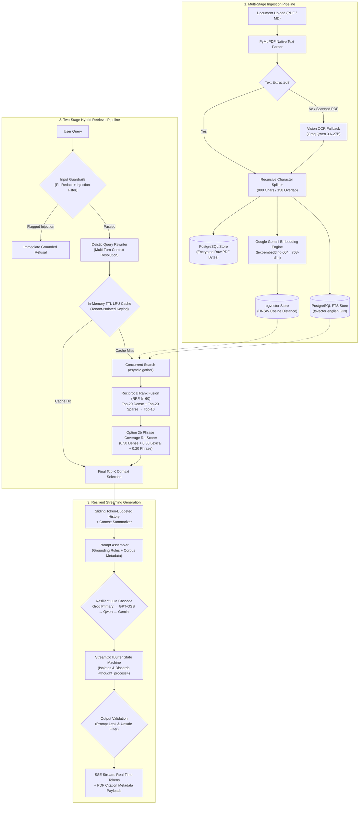

<div align="center">

# ⚡ KueryCore AI

### *Enterprise Document Intelligence & Production-Hardened Hybrid RAG Platform*

[](https://fastapi.tiangolo.com)
[](https://github.com/pgvector/pgvector)
[](https://react.dev)
[](https://python.org)
[](https://groq.com)
[](LICENSE)

<p align="center">
  <a href="#-system-architecture--request-lifecycle">Architecture</a> •
  <a href="#-core-capabilities">Capabilities</a> •
  <a href="#-technical-specifications">Tech Stack</a> •
  <a href="#-project-structure">Project Structure</a> •
  <a href="#-api-contract--endpoints">API Docs</a> •
  <a href="#-environment-setup--local-development">Quickstart</a> •
  <a href="#-verification--automated-tests">Testing</a>
</p>

</div>

---

KueryCore AI is an enterprise-grade Retrieval-Augmented Generation (RAG) platform designed to ingest, index, and query unstructured documents with sub-second hybrid retrieval, real-time Server-Sent Events (SSE) streaming, deterministic PDF citation fidelity, and multi-tenant security isolation.

---

## ◈ System Architecture & Request Lifecycle



---

## ◆ Core Capabilities

* **Two-Stage Hybrid Search & RRF Re-ranking:**
  * **Stage 1 (Concurrent Retrieval):** Queries `pgvector` HNSW index (top 20) and PostgreSQL Full-Text Search with `ts_rank_cd` (top 20) concurrently via `asyncio.gather`.
  * **Reciprocal Rank Fusion (RRF):** Fuses candidates using rank smoothing constant $k=60$ into a top-10 candidate pool.
  * **Stage 2 (Option 2b Re-scorer):** Normalizes three independent signals ($0.50 \cdot S_{\text{vector}} + 0.30 \cdot S_{\text{lexical}} + 0.20 \cdot S_{\text{phrase}}$) for high-precision snippet selection.
* **Resilient Multi-Provider LLM Fallback Cascade:**
  * Primary: Groq LLaMA 3.3 70B Versatile
  * Fallback 1: Groq OpenAI GPT-OSS 120B
  * Fallback 2: Groq Qwen 3.6 27B
  * Fallback 3: Google Gemini 1.5 Flash (Cross-provider cloud safety net)
* **Intelligent Document Parsing & OCR Fallback:**
  * PyMuPDF for fast digital PDF extraction.
  * Automatic image-density OCR fallback via Groq Vision (`qwen/qwen3.6-27b`) for scanned, handwritten, or image-only documents.
* **Tenant-Isolated In-Process Query Cache:**
  * Deterministic exact-normalized matching with TTL LRU eviction.
  * Tenant-isolated keys (`{user_id}.{doc_id}.{top_k}.{query}`) with automatic $O(1)$ full cache invalidation on any document upload, reindex, or deletion.
* **Strict Multi-Layered Guardrails:**
  * **Input Sanitization:** Redacts emails, phone numbers, SSNs, credit cards, and UUIDs to `[REDACTED:<type>]`.
  * **Injection Defense:** Filters known prompt injection patterns and obfuscation runs (base64/unicode).
  * **Output Validation:** Intercepts system prompt fragments and unsafe keyword phrases before streaming to client.
* **Stateless Multi-Tenant JWT Auth & Security:**
  * PBKDF2-HMAC-SHA256 password hashing.
  * RFC 7519 HMAC-SHA256 JWT access tokens paired with atomic compare-and-swap `refresh_token_jti` rotation.
  * Peer-anchored client IP rate limiting via SlowAPI (`10/minute` auth, `60/minute` chat, `5/hour` account deletion).
* **Interactive PDF Citation Viewer:**
  * Integrated React PDF viewer supporting one-click citation pill jumping directly to source pages and bounding snippets.

---

## ◇ Technical Specifications

| Subsystem | Technology | Purpose |
| :--- | :--- | :--- |
| **Backend API** | FastAPI, Uvicorn, SlowAPI | Async REST endpoints, Server-Sent Events (SSE), and rate limiting |
| **Database** | PostgreSQL 16 + `pgvector` | Relational entity storage, HNSW vector indexing, and English FTS GIN indexes |
| **ORM & Migrations** | SQLAlchemy 2.0 (Async), Alembic | Async ORM mappings, connection pooling, and schema migration ledger |
| **Embeddings** | `langchain-google-genai` | Google `text-embedding-004` (768-dimensional dense vectors) |
| **Inference Orchestration** | `langchain-groq`, `langchain-core` | Low-latency LLM generation with LangChain `with_fallbacks()` cascade |
| **Document Parsing** | PyMuPDF (fitz), Groq Vision | Digital text extraction and scanned PDF OCR |
| **Frontend UI** | React 19, Vite, Tailwind CSS, Lucide | Modern glassmorphic SPA with real-time SSE token rendering and PDF viewer |
| **Testing** | Pytest, Pytest-Asyncio, Vitest | Comprehensive backend integration testing and frontend component unit tests |

---

## ▧ Project Structure

```
KueryCore/
├── backend/
│   ├── alembic/                 # Database schema migration versions
│   ├── app/
│   │   ├── core/                # Security, JWT, PBKDF2, and rate limiter configuration
│   │   ├── models/              # SQLAlchemy models (User, Document, Chunk, Conversation, Message, QueryLog)
│   │   ├── routers/             # FastAPI routers (auth, documents, chat, conversations, analytics)
│   │   ├── schemas/             # Pydantic request/response validation schemas
│   │   ├── services/            # Core business logic:
│   │   │   ├── email.py         # Multi-provider email delivery (Brevo API, SMTP, Resend)
│   │   │   ├── evaluation.py    # RAG benchmark eval harness & judge scoring
│   │   │   ├── generation.py    # LLM fallback cascade, prompt template, and StreamCoTBuffer
│   │   │   ├── guardrails.py    # PII redaction, prompt injection filter, output validator
│   │   │   ├── ingestion.py     # Document parser, OCR fallback, and text splitter
│   │   │   ├── memory.py        # Background conversation summarizer
│   │   │   ├── query_cache.py   # In-memory TTL LRU query cache
│   │   │   ├── retrieval.py     # Two-stage hybrid search engine (pgvector + FTS + RRF)
│   │   │   └── rewrite.py       # Conversational follow-up query rewriter
│   │   ├── config.py            # Centralized Pydantic application settings
│   │   ├── database.py          # Async SQLAlchemy engine and session factory
│   │   └── main.py              # Application lifespan, CORS, and router registration
│   ├── requirements.txt         # Backend Python dependencies
│   └── tests/                   # Pytest test suite (auth, guardrails, retrieval, cache, cot)
├── frontend/
│   ├── src/
│   │   ├── components/          # React UI components (Sidebar, ChatArea, PdfViewer, UploadPanel, AuthModal)
│   │   ├── hooks/               # Custom hooks (useConversations, useChatStream)
│   │   ├── services/            # Frontend API client and event-stream consumers
│   │   └── tests/               # Vitest component and hook unit tests
│   ├── package.json             # Frontend dependencies
│   └── vite.config.js           # Vite development and build configuration
├── docker-compose.yml           # Full-stack container orchestration
├── Dockerfile                   # Backend production container specification
└── README.md                    # Project documentation
```

---

## ◬ API Contract & Endpoints

### Authentication (`/api/auth`)

| Method | Endpoint | Description | Rate Limit |
| :--- | :--- | :--- | :--- |
| `POST` | `/api/auth/signup` | Register a new user account | `10/minute` |
| `POST` | `/api/auth/login` | Authenticate with credentials and receive access/refresh tokens | `10/minute` |
| `POST` | `/api/auth/refresh` | Rotate refresh token with atomic CAS JTI validation | `30/minute` |
| `GET` | `/api/auth/me` | Fetch authenticated user profile and account details | - |
| `DELETE`| `/api/auth/me` | GDPR self-service account deletion and cascade data purge | `5/hour` |
| `POST` | `/api/auth/forgot-password`| Request password reset email token | `5/minute` |
| `POST` | `/api/auth/reset-password` | Set new password using verified token | `5/minute` |

### Documents (`/api/documents`)

| Method | Endpoint | Description |
| :--- | :--- | :--- |
| `POST` | `/api/documents/upload` | Upload PDF or Markdown document for async ingestion |
| `GET` | `/api/documents` | List all documents belonging to current authenticated tenant |
| `GET` | `/api/documents/{id}` | Retrieve document status, page count, and chunk count |
| `GET` | `/api/documents/{id}/file` | Serve raw PDF bytes for authenticated inline citation viewing |
| `DELETE`| `/api/documents/{id}` | Delete document and cascade chunks with cache invalidation |
| `POST` | `/api/documents/{id}/reindex` | Trigger re-chunking and re-embedding pipeline |

### Chat & Streaming (`/api/chat`)

| Method | Endpoint | Description |
| :--- | :--- | :--- |
| `POST` | `/api/chat` | Standard single-turn chat completion with retrieved citations |
| `POST` | `/api/chat/stream` | Real-time Server-Sent Events (SSE) token stream with citation metadata |

#### SSE Event Protocol:

```text
event: citation
data: {"citation_id": 1, "document_id": "uuid", "display_title": "Q3_Report.pdf", "page_number": 4, "similarity": 0.89, "snippet": "..."}

event: token
data: {"token": "KueryCore"}

event: token
data: {"token": " utilizes"}

event: end
data: {"status": "completed", "latency_ms": 380}
```

### Conversations & Analytics

| Method | Endpoint | Description |
| :--- | :--- | :--- |
| `GET` | `/api/conversations` | Paginated list of user conversation sessions |
| `GET` | `/api/conversations/{id}` | Fetch full message history for a conversation |
| `DELETE`| `/api/conversations/{id}` | Delete conversation and associated message logs |
| `GET` | `/api/analytics` | Summary of workspace documents, queries, and chunk distribution |
| `GET` | `/api/health` | Diagnostic health check (DB, embeddings, and generative LLM status) |

---

## ▧ Environment Setup & Local Development

### Prerequisites

* Python `3.11+`
* Node.js `20+` and `npm`
* PostgreSQL `16` with `pgvector` enabled

### 1. Backend Setup

```bash
# Navigate to backend directory
cd backend

# Create and activate virtual environment
python -m venv venv
source venv/bin/activate  # On Windows: .\venv\Scripts\activate

# Install Python dependencies
pip install -r requirements.txt

# Configure environment variables
cp .env.example .env
# Edit .env and supply your GROQ_API_KEY, GEMINI_API_KEY, DATABASE_URL, and JWT_SECRET_KEY

# Run database migrations
alembic upgrade head

# Start FastAPI development server
uvicorn app.main:app --host 0.0.0.0 --port 8000 --reload
```

### 2. Frontend Setup

```bash
# Navigate to frontend directory
cd frontend

# Install dependencies
npm install

# Start Vite development server
npm run dev
```

### 3. Docker Compose (Full Stack)

```bash
docker-compose up --build
```

---

## ▣ Verification & Automated Tests

```bash
# Run backend test suite
cd backend
pytest tests/ -v

# Run frontend test suite
cd frontend
npm test -- --run

# Build frontend production bundle
npm run build
```

---

## ⎋ License

Distributed under the **MIT License**. See `LICENSE` for details.
